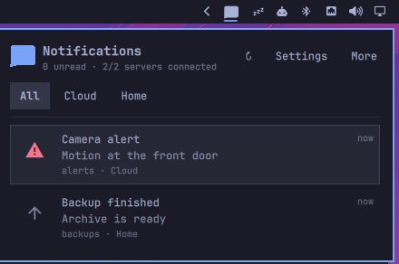
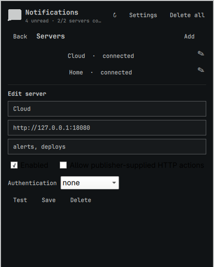

# Omartfy

[](https://github.com/DailenG/omartfy/releases/latest)
[](https://github.com/DailenG/omartfy/actions/workflows/ci.yml)
[](LICENSE)

A multi-server [ntfy](https://ntfy.sh/) client for the Omarchy bar. Omartfy combines notifications from ntfy.sh and self-hosted servers into one keyboard-friendly panel while keeping each server's authentication, connection state, and unread count separate.

**[Website](https://daileng.github.io/omartfy/)** · **[Latest release](https://github.com/DailenG/omartfy/releases/latest)** · **[Report a bug](https://github.com/DailenG/omartfy/issues/new)**



> The screenshots use local fixture data. Omartfy follows the active Omarchy theme.

## Features

- One symbolic bar icon with unread, urgent, and connection indicators
- Merged chronological **All** inbox plus per-server tabs and quick filtering
- Multiple topics and credentials per server profile
- Bearer token, Basic, and unauthenticated connections
- Local read, delete, and clear state without publishing changes to ntfy
- ntfy view, copy, and opt-in HTTP actions in an ntfy-style action row
- Timed or indefinite DND from the bar context menu
- Lazy icon and image-attachment previews with strict size, format, redirect, and origin checks
- Keyboard navigation, inline search, overflow tabs, and a dedicated server editor
- Durable cursor replay and event deduplication across shell restarts

## Requirements

- Omarchy with the Quattro shell plugin system
- Python 3
- `setpriv` from util-linux
- `wl-copy` from wl-clipboard
- `omarchy-launch-browser`

No pip package, npm package, third-party ntfy SDK, SSE package, or WebSocket package is required.

## Install

```bash
omarchy plugin add https://github.com/DailenG/omartfy --enable
```

The widget defaults to the right bar section. Open the panel and select **Settings** to add an ntfy server and one or more comma-separated topics.

Omartfy intentionally creates no default subscription: an unprotected ntfy topic name can act as a public address.

### Update

```bash
omarchy plugin update dailen.omartfy
```

Restart the shell only if an update does not hot-reload:

```bash
omarchy restart shell
```

## Configure servers



Each profile has its own connection and trust boundary:

- **Label:** unique local name shown on tabs and notifications
- **Base URL:** `https://ntfy.sh` or a self-hosted HTTP(S) URL; reverse-proxy path prefixes are supported
- **Topics:** one or more comma-separated ntfy topic names
- **Authentication:** none, Bearer token, or Basic username/password
- **Allow publisher-supplied HTTP actions:** disabled by default; enable only for trusted publishers
- **Allow credentials over insecure HTTP:** shown only when credentials would cross non-loopback plain HTTP

A blank secret while editing an existing profile preserves the stored secret. Selecting a connected server filters the inbox; use the pencil button in **Settings** to edit that profile.

## Keyboard controls

Omarchy plugins do not claim global compositor shortcuts. To open Omartfy directly with `Super+N`, add this user-level binding to `~/.config/hypr/bindings.lua`:

```lua
o.bind("SUPER + N", "Omartfy notifications", "omarchy-shell shell toggle dailen.omartfy '{}'")
```

The panel focuses its first notification when opened from the shortcut.

| Key | Action |
| --- | --- |
| `j` / `k`, Up / Down | Select notification |
| `h` / `l`, Left / Right | Switch server tab |
| Enter / Space | Mark selected notification as read |
| `e` | Expand or collapse selected notification |
| `1`–`3` | Run the corresponding visible ntfy action |
| `o` | Open the notification click URL |
| `a` | Open the attachment URL |
| `d`, `x`, or Delete | Delete locally |
| `r` | Reconnect and reload |
| `s` | Open server settings |
| `/` | Search |
| Escape | Close search, nested UI, or panel |
| Tab / Shift-Tab | Switch adjacent Omarchy panels |

## Do Not Disturb

Right-click the Omartfy bar icon and choose **1 hour**, **4 hours**, **Until tomorrow**, or **Until turned off**. DND continues collecting notifications while suppressing the unread badge and urgent icon color. The setting survives shell restarts; use **Turn off DND** from the same menu to resume normal presentation.

## Data and security

Omarchy plugins run unsandboxed with the current user's permissions. Omartfy:

- Reads configuration from `${XDG_CONFIG_HOME:-~/.config}/omarchy/ntfy.json`
- Stores cursor, notification, deletion, DND, and media state under `${XDG_STATE_HOME:-~/.local/state}/omarchy/ntfy/`
- Writes configuration and state atomically with mode `0600`; the state directory uses mode `0700`
- Stores configured tokens and passwords locally in the mode-`0600` JSON configuration file; it does not use a keyring
- Sends credentials only in HTTP authorization headers, never URLs or process arguments
- Never disables TLS certificate verification
- Keeps HTTP actions disabled per server until explicitly enabled
- Runs publisher-provided HTTP actions only after user activation, without redirects or retries
- Launches validated HTTP(S) view URLs through `omarchy-launch-browser` and copies values through `wl-copy`

Review topic access controls and publisher trust before enabling a server or HTTP actions. See [SECURITY.md](SECURITY.md) for the reporting policy and implementation boundaries.

## Troubleshooting

### A server stays “connecting”

Use the profile's **Test** button first. Confirm that the base URL is reachable, the topic exists, and the configured credentials can read it. Reverse proxies must allow long-lived HTTP streaming; if they buffer or close the stream, Omartfy automatically falls back to periodic polling.

### Messages or topics appear stale

Press `r` or use the ↻ header button to reconnect and reload configuration. Omartfy resumes from its persisted ntfy cursor and deduplicates replayed events.

### Actions are disabled

View and copy actions require a valid destination. HTTP actions additionally require **Allow publisher-supplied HTTP actions** on that server. Enable it only when every publisher on the subscribed topics is trusted.

### The panel does not open

Validate the installed plugin and restart the shell:

```bash
omarchy plugin validate ~/.config/omarchy/plugins/dailen.omartfy
omarchy restart shell
```

## Remove

```bash
omarchy plugin remove dailen.omartfy
```

Removal leaves configuration and local notification history in place so reinstalling does not lose state. To remove that data too, after removing the plugin run:

```bash
rm -rf ~/.config/omarchy/ntfy.json ~/.local/state/omarchy/ntfy
```

## Development

Validate and test from the repository root:

```bash
python3 -W error::ResourceWarning -m unittest discover -s test -p 'test_*.py'
node --test test/model.test.js
omarchy plugin validate "$PWD"
```

`test/mock_ntfy.py` provides a local ntfy-compatible HTTP fixture for stream, action, authentication, and media checks. Contribution setup and pull-request expectations are in [CONTRIBUTING.md](CONTRIBUTING.md).

## License

Omartfy is licensed under the [MIT License](LICENSE). Copyright © 2026 Dailen Gunter.

The ntfy mask in `assets/ntfy-mask.svg` is copied from ntfy commit `4c2b69e0591b51d7ed7b2e71954f0f7be936b47f` and remains licensed under Apache-2.0. Its attribution and complete license text are preserved in the asset and [`third_party/ntfy-APACHE-2.0.txt`](third_party/ntfy-APACHE-2.0.txt).
